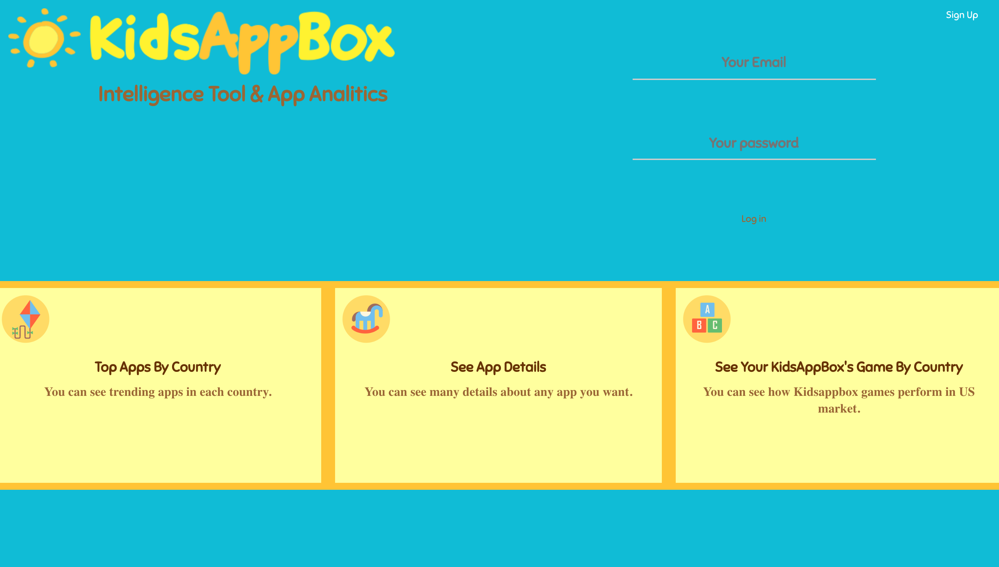

## KidsAppBox Intelligence Tool & App Analitics

### Summary

#### The tool that will be used by KidsAppBox's employees to get insight about mobile app industry in a quick and user friendly way. With that tool employees of KidsAppBox can easily track the performance and review distributions of their own apps by the help of dashboard in real time.

### About The Developer

#### KidsAppBox Intelligence Tool was created by Merve Baran. Learn more about the developer on [Linkedin](https://www.linkedin.com/in/merve-baran-355613161/)

### Technologies

# Tech Stack:

* Back-End: Python, Flask, Jinja, SQLAlchemy, PostgreSQL
+ Front-End: HTML/CSS, Bootstrap, JQuery, JavaScript, AJAX, Chart,js

### Features

#### For each countries that KidsAppBox markets its games it is possible to see the trending apps with this feature. KidsAppBox employees can see Top 20 apps by country. There is also a link for each of these 20 apps which forwards the traffic to the App Details page once a user clicks it.

#### A KidsAppBox employee can see the details of any app she wants by using the second feature of KidsAppBox Intelligence Tool. Only app id and the platform of the app (itunes or android) is required to see the details. It is also possible to see the real time rating distribution of the app that is searched for.

#### Every single employee has her own dasboard for the KidsAppBox apps that were designated to her. She can see all apps that she is responsible from on a single page with donut charts showing the rating distributions of the apps. This is the third feature of the tool that makes employees job easier by extracting insights from app ratings data.

### Set Up / Installation

#### Python 3.6 (or higher) and PostgreSQL are required.

#### Clone or fork this repo:

`$ git clone https://github.com/mrvbrn/HB_project.git`

#### Get an Api from [AppMonstra](https://appmonsta.com/dashboard/api-documentation/?python#introduction) and save it to a file called `secrets.sh`:

`export USERNAME='YOUR_API_KEY'

 export PASSWORD='X'` 

#### Create a virtual environment:

`$ virtualenv env`

#### Install dependencies:

`$ pip3 install -r requirements.txt`

#### Create database:

`$ createdb employees`

#### Build database tables and seed file:

`$ python3 model.py

 $ python3 seed.py `

#### Be sure your virtual environment and secrests.sh file are activated:

`$ source virtual env/bin/activate

 $ source secrets.sh`

#### Run the app via command line:

`$ python3 server.py`

#### Open your browser and navigate to:

`http://localhost:5000/`
